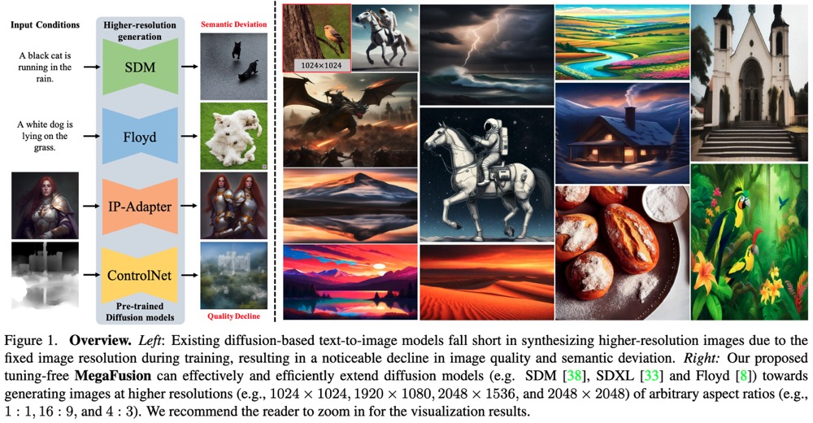

# MegaFusion: Extend Diffusion Models towards Higher-resolution Image Generation without Further Tuning [WACV 2025]
This repository contains the official PyTorch implementation of MegaFusion: https://arxiv.org/abs/2408.11001/

<div align="center">
   
</div>

## Some Information
[Project Page](https://haoningwu3639.github.io/MegaFusion/)  $\cdot$ [Paper](https://arxiv.org/abs/2408.11001/)

## News
- [2024.11] Code of MegaFusion has been released.
- [2024.10] MegaFusion has been accepted to WACV 2025.
- [2024.9] A new version of the paper has been updated.
- [2024.8] Our pre-print paper is released on arXiv.

## Requirements
- Python >= 3.8 (Recommend to use [Anaconda](https://www.anaconda.com/download/#linux) or [Miniconda](https://docs.conda.io/en/latest/miniconda.html))
- [PyTorch >= 2.1.0](https://pytorch.org/)
- xformers == 0.0.27
- diffusers == 0.31.0
- accelerate == 0.17.1
- transformers == 4.46.3
- triton == 2.3.1

A suitable [conda](https://conda.io/) environment named `megafusion` can be created and activated with:

```
conda env create -f environment.yaml
conda activate megafusion
```

## Inference
Since our MegaFusion is designed to extend existing diffusion-based text-to-image models towards higher-resolution generation. 
We provide the offical MegaFusion implementations on several representative models, including StableDiffusion, StableDiffusion-XL, StableDiffusion-3, DeepFloyd, ControlNet, and IP-Adapter.

### Inference with SDM-MegaFusion
First, please download pre-trained StableDiffusion-1.5 from [SDM-1.5](https://huggingface.co/stable-diffusion-v1-5/stable-diffusion-v1-5). 
Then, all the pre-trained checkpoints should be placed into the corresponding location in the folder `./SDM-MegaFusion/ckpt/stable-diffusion-v1-5/`.

Run the inference demo with:
```
cd SDM-MegaFusion
CUDA_VISIBLE_DEVICES=0 accelerate launch inference.py --if_dilation False --if_reschedule False
```

### Inference with SDXL-MegaFusion
Taking computational overhead into consideration, we only use SDXL-base, and discard SDXL-refiner in our project. 
First, please download pre-trained StableDiffusion-XL from [SDXL-base](https://huggingface.co/stabilityai/stable-diffusion-xl-base-1.0/). 
Then, all the pre-trained checkpoints should be placed into the corresponding location in the folder `./SDXL-MegaFusion/ckpt/`.

Note: Since the VAE of this ckpt does not support float16 inference, we recommend that you download the fixed version of VAE checkpoint from [sdxl-vae-fp16-fix](https://huggingface.co/madebyollin/sdxl-vae-fp16-fix) to support generation under float16.

Run the inference demo with:
```
cd SDXL-MegaFusion
CUDA_VISIBLE_DEVICES=0 accelerate launch inference.py --if_dilation False --if_reschedule False
```

### Inference with SD3-MegaFusion
First, please download pre-trained StableDiffusion-3-medium from [SD3](https://huggingface.co/stabilityai/stable-diffusion-3-medium).
Then, all the pre-trained checkpoints should be placed into the corresponding location in the folder `./SD3-MegaFusion/ckpt/

Run the inference demo with:
```
cd SD3-MegaFusion
CUDA_VISIBLE_DEVICES=0 python inference.py
```

### Inference with Floyd-MegaFusion
Taking computational overhead into consideration, we only use the first two stages of DeepFloyd, and discard the last stage in our project.
First, please download pre-trained DeepFloyd from [DeepFloyd](https://huggingface.co/DeepFloyd/IF-I-XL-v1.0/). Then, all the pre-trained checkpoints should be placed into the corresponding location in the folder `./DeepFloyd/ckpt/`.

To be updated soon...

### Inference with IP-Adapter-MegaFusion
First, please download pre-trained StableDiffusion-1.5 from [SDM-1.5](https://huggingface.co/stable-diffusion-v1-5/stable-diffusion-v1-5). 
Then, all the pre-trained checkpoints should be placed into the corresponding location in the folder `./IP-Adapter-MegaFusion/ckpt/stable-diffusion-v1-5/`.
Moreover, download pre-trained IP-Adapter from [IP-Adapter](https://huggingface.co/h94/IP-Adapter), and place it into `./IP-Adapter-MegaFusion/ckpt/`

Run the inference demo with:
```
cd IPAdapter-MegaFusion
CUDA_VISIBLE_DEVICES=0 python inference.py
```

### Inference with ControlNet-MegaFusion

Run the inference demo with:
```
cd ControlNet-MegaFusion
CUDA_VISIBLE_DEVICES=0 python inference.py
```
To be updated soon...

## Evaluation

### Dataset
Our main experiments are conducted on the commonly used MS-COCO dataset, you can download it from [MS-COCO](https://cocodataset.org/#home).

### Metrics
We use the commonly used [FID](https://github.com/mseitzer/pytorch-fid) and KID as main evalutaion metrics.
Besides, to quantitatively evaluate the semantic correctness of the synthesized results, we also utilize several language-based scores in our work, including CLIP-T CIDEr, Meteor, and ROUGE.

To be updated soon...

### Caption synthesized images with VLM
In our project, we use a state-of-the-art open-sourced VLM, [MiniGPT-v2](https://github.com/Vision-CAIR/MiniGPT-4) to give a caption for each synthesized image, to further evaluate the semantic correctness of higher-resolution generation.

To be updated soon...

## TODO
- [x] Release Paper
- [x] Complete Bibtex
- [x] Code of SDM-MegaFusion
- [x] Code of SDXL-MegaFusion
- [x] Code of SD3-MegaFusion
- [x] Code of IPAdapter-MegaFusion
- [ ] Code of Floyd-MegaFusion
- [ ] Code of ControlNet-MegaFusion
- [ ] Image Caption Code of MiniGPT-v2
- [ ] Evaluation Code


## Citation
If you use this code for your research or project, please cite:

	@InProceedings{wu2024megafusion,
            author    = {Wu, Haoning and Shen, Shaocheng and Hu, Qiang and Zhang, Xiaoyun and Zhang, Ya and Wang, Yanfeng},
            title     = {MegaFusion: Extend Diffusion Models towards Higher-resolution Image Generation without Further Tuning},
            booktitle = {Proceedings of the IEEE/CVF Winter Conference on Applications of Computer Vision (WACV)},
            year      = {2025},
      }

## Acknowledgements
Many thanks to the code bases from [diffusers](https://github.com/huggingface/diffusers), [SimpleSDM](https://github.com/haoningwu3639/SimpleSDM), 
[SimpleSDXL](https://github.com/haoningwu3639/SimpleSDXL), [SimpleSDM-3](https://github.com/haoningwu3639/SimpleSDM-3), and [DeepFloyd](https://github.com/deep-floyd/IF).

## Contact
If you have any questions, please feel free to contact haoningwu3639@gmail.com or shenshaocheng@sjtu.edu.cn.
